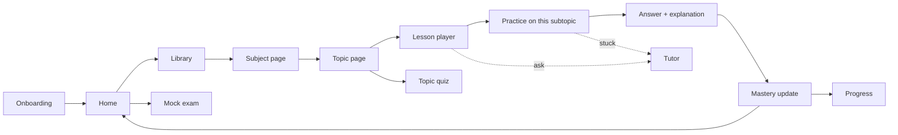
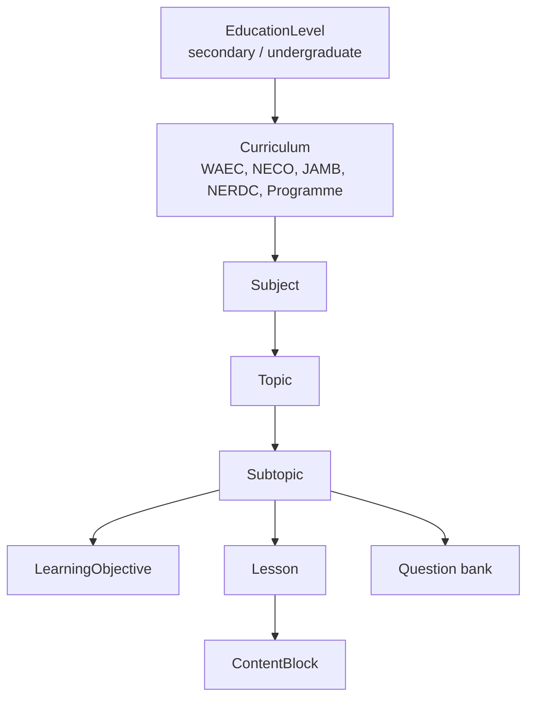
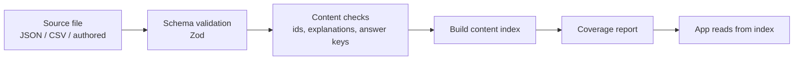

# Mindspark — Rebuild & Build Guide

**Status:** Authoritative. Supersedes `docs/implementation-plan.md` (single-subject scope) and the earlier production roadmap.
**Scope:** Multi-subject learning platform for Nigerian secondary school and undergraduate students.
**Stage:** Local development. No deployment, no Clerk/DB provisioning in this phase.

---

## 1. Honest audit of what exists today

The current build is a **Mathematics demo wearing a platform's clothes**. Verified facts, not impressions:

| Area | Claimed | Actual state |
|------|---------|--------------|
| Curriculum content | "Curriculum packages" | 2 JSON files, 8 concepts, 2 lessons, **0 questions** |
| Practice | "Adaptive practice engine" | 5 questions hardcoded in `lib/domain/assessment/practice-bank.ts`; only 3 ever served; all algebra |
| Library | "Browse subjects and topics" | 1 hardcoded card; `Explore` links to `/learn/linear-equations` |
| Lesson | "Schema-driven renderer" | `equation-workspace.tsx` hardcodes `3x + 5 = 20` and three fixed operations |
| Knowledge map | "Graph service" | 2 hardcoded arrays in `lib/domain/knowledge-graph/graph.ts` |
| Diagnostic | "Adaptive branching" | 8 hardcoded Mathematics questions |
| Quiz / mock exam | — | **Does not exist.** No route, no engine |
| Student model | "Per-concept mastery" | `StudentProfile.linearEquationsMastery: number` — a single hardcoded subject field |
| Routes | "Learning spaces" | `/learn/linear-equations`, `/practice/linear-equations` — subject baked into the URL |

### Root cause

There is **no subject / topic / subtopic entity anywhere in the codebase**. Every layer — types, routes, content, mastery — assumes one topic in one subject. This is not a content shortage; it is a **modelling failure**. It cannot be fixed by adding more JSON.

### What is worth keeping

| Asset | Why |
|-------|-----|
| Next.js 15 App Router + feature-module structure | Sound foundation |
| Maths Studio visual language (`src/styles.css`) | Distinctive, not generic SaaS. Must be de-branded from "Maths" |
| Server-action pattern for authoritative scoring | Correct architecture |
| Tutor fallback abstraction (`lib/domain/tutor/fallback.ts`) | Deterministic without AI keys |
| Vitest + Playwright + CI harness | Reusable |

### What gets deleted

`practice-bank.ts` · `graph.ts` hardcoded arrays · `branching.ts` question list · `equation-workspace.tsx` as the lesson engine · `linearEquationsMastery` field · `/learn/linear-equations` and `/practice/linear-equations` routes · `library-browser.tsx` hardcoded subjects · both existing content JSON files.

---

## 2. What the product actually is

> A learning platform where a secondary school or undergraduate student can **learn** a topic, **practise** what they learned, **take exam-style quizzes**, and **watch their mastery grow** — across every subject they study.

### The four verbs

| Verb | Question it answers | Surface |
|------|--------------------|---------|
| **Learn** | "Teach me this topic" | Lesson player |
| **Practise** | "Let me try questions on what I just learned" | Practice session |
| **Quiz** | "Test me under exam conditions" | Timed mock (WAEC/NECO/JAMB style) |
| **Track** | "What do I know, what's weak?" | Progress |

Supporting: **Tutor** (ask anything, in context), **Library** (browse everything), **Recommendations** (what next).

### Non-negotiable rules

1. **Every subject is a first-class citizen.** Mathematics is not special. If a feature only works for Mathematics, it is not built.
2. **No screen ships with content defined in a `.tsx` or `.ts` file.** All content loads from `content/`.
3. **Practice and Quiz are always scoped.** The user picks subject → topic before answering anything. Never dumped into a default subject.
4. **Every question has an explanation.** A question without an explanation is a quiz app, not a learning platform.
5. **Mastery is per subtopic**, aggregated up to topic and subject. Never a single global number.

---

## 3. User journeys

### 3.1 Primary student loop



### 3.2 Onboarding (short — no long questionnaire)

1. Preferred name
2. Education level → **Secondary** (JSS1–SS3) or **Undergraduate** (institution, programme, year)
3. Exam target → WAEC / NECO / JAMB / None (secondary only)
4. **Subject selection** — pick the subjects they study (multi-select, minimum 1)
5. Optional short diagnostic **per selected subject** (skippable)

Result: a personalised Home showing only their subjects.

### 3.3 Learn journey

```
/library → pick subject → pick topic → pick subtopic → lesson player
```

Lesson player runs a **sequence of content blocks** (see §5.3), ends with a recap and a direct CTA: **"Practise this subtopic"**.

### 3.4 Practice journey

```
/practice → pick subject → pick topic (or "mixed") → session starts
```

- Adaptive difficulty within the session
- Immediate feedback after each question: correct/incorrect, **why**, and the misconception if detected
- "Learn this" link back to the source subtopic when wrong
- Session summary → mastery update → next recommendation

Never auto-routes to a subject the student didn't choose.

### 3.5 Quiz / mock exam journey

```
/quiz → choose: Topic quiz | Subject mock | Full exam mock (WAEC/NECO/JAMB)
     → timed session, no feedback during
     → submit → score + full review with explanations
```

Distinct from Practice: **timed, no hints, no mid-session feedback, exam-weighted question mix.**

### 3.6 Tutor

Context-aware. When opened from a lesson it already knows subject/topic/subtopic. Grounded in that subtopic's content. Falls back to deterministic Socratic prompts without an API key.

---

## 4. Domain model

### 4.1 Canonical hierarchy



### 4.2 Stable ID convention — MANDATORY

Parallel agents must never collide on IDs. IDs are lowercase, hyphenated, dot-separated:

| Entity | Pattern | Example |
|--------|---------|---------|
| Subject | `{level}.{subject}` | `sec.mathematics` |
| Topic | `{level}.{subject}.{topic}` | `sec.mathematics.algebra` |
| Subtopic | `{level}.{subject}.{topic}.{subtopic}` | `sec.mathematics.algebra.linear-equations` |
| Objective | `{subtopicId}.o{n}` | `sec.mathematics.algebra.linear-equations.o1` |
| Lesson | `{subtopicId}.lesson` | `sec.mathematics.algebra.linear-equations.lesson` |
| Question | `{subtopicId}.q{nnn}` | `sec.mathematics.algebra.linear-equations.q007` |
| Past question | `pq.{board}.{year}.{subject}.{nnn}` | `pq.waec.2019.mathematics.014` |

`level` ∈ `sec` | `ug`. IDs are permanent. Renaming an ID is a breaking change.

### 4.3 Mastery model

Replaces `linearEquationsMastery` entirely.

```ts
MasteryRecord {
  subtopicId: string     // primary unit of mastery
  score: number          // 0-100
  state: not_started | exploring | developing | proficient | mastered
  evidenceCount: number
  lastPractisedAt: string
}
```

Topic mastery = weighted mean of its subtopics. Subject mastery = weighted mean of its topics. Never stored — always derived, so it can't drift.

---

## 5. Content package format

### 5.1 Directory layout

One directory per subject. **This is the collision boundary for parallel agents.**

```
content/
  subjects/
    mathematics/
      subject.json           # subject meta + topic/subtopic tree
      topics/
        algebra/
          linear-equations.lesson.json
          linear-equations.questions.json
          quadratic-equations.lesson.json
          quadratic-equations.questions.json
        geometry/
          ...
    english/
    biology/
    ...
  exams/
    waec/mathematics-2019.questions.json      # past-question sets
    jamb/biology-2021.questions.json
```

### 5.2 `subject.json`

```jsonc
{
  "id": "sec.mathematics",
  "level": "secondary",
  "name": "Mathematics",
  "shortName": "Maths",
  "description": "…",
  "curricula": ["WAEC", "NECO", "JAMB", "NERDC"],
  "classLevels": ["JSS1", "JSS2", "JSS3", "SS1", "SS2", "SS3"],
  "accentColor": "#0c4dcc",
  "icon": "MathOperations",
  "topics": [
    {
      "id": "sec.mathematics.algebra",
      "name": "Algebra",
      "classLevels": ["SS1", "SS2", "SS3"],
      "order": 3,
      "subtopics": [
        {
          "id": "sec.mathematics.algebra.linear-equations",
          "name": "Linear Equations",
          "order": 1,
          "prerequisites": ["sec.mathematics.algebra.expressions"],
          "objectives": [
            { "id": "…o1", "text": "Solve one-step linear equations" },
            { "id": "…o2", "text": "Solve two-step linear equations" }
          ]
        }
      ]
    }
  ],
  "provenance": {
    "sources": [{ "id": "waec-syllabus", "title": "WAEC Mathematics Syllabus", "type": "syllabus" }],
    "reviewStatus": "published"
  }
}
```

### 5.3 Lesson format — subject-agnostic content blocks

The single most important change. Blocks work for Biology and Literature as well as Mathematics.

```jsonc
{
  "id": "sec.mathematics.algebra.linear-equations.lesson",
  "subtopicId": "sec.mathematics.algebra.linear-equations",
  "title": "Solving Linear Equations",
  "estimatedMinutes": 12,
  "blocks": [
    { "type": "hook",     "text": "Every equation is a balance…" },
    { "type": "text",     "markdown": "A **linear equation** is…" },
    { "type": "math",     "latex": "3x + 5 = 20", "caption": "Solve for x" },
    { "type": "callout",  "variant": "definition", "title": "Inverse operation", "text": "…" },
    { "type": "image",    "src": "/content/…/balance.svg", "alt": "Balance scale …" },
    { "type": "table",    "headers": ["Step","Action"], "rows": [["1","Subtract 5"]] },
    { "type": "worked_example", "title": "…", "steps": [{ "text": "…", "latex": "…" }] },
    { "type": "check",    "questionId": "sec.mathematics.algebra.linear-equations.q001" },
    { "type": "interactive", "component": "equation-balance", "props": { "equation": "3x+5=20" } },
    { "type": "summary",  "points": ["…", "…"] }
  ]
}
```

**Block types (v1):** `hook` `text` `math` `image` `table` `list` `callout` `worked_example` `check` `interactive` `video` `summary`

`interactive` is optional and pluggable — Mathematics may use `equation-balance`, Chemistry `periodic-table`, History `timeline`. **A lesson must be complete and useful without any interactive block**, so no subject is blocked on a custom component.

### 5.4 Question format

```jsonc
{
  "id": "sec.mathematics.algebra.linear-equations.q007",
  "subtopicId": "sec.mathematics.algebra.linear-equations",
  "objectiveIds": ["…o2"],
  "type": "mcq",
  "difficulty": 2,
  "stem": "Solve for $x$: $4x + 2 = 18$",
  "options": [
    { "id": "a", "text": "$x = 4$" },
    { "id": "b", "text": "$x = 5$" },
    { "id": "c", "text": "$x = 8$" },
    { "id": "d", "text": "$x = 20$" }
  ],
  "correctOptionId": "a",
  "explanation": "Subtract 2 from both sides to get $4x = 16$, then divide by 4 to get $x = 4$.",
  "distractorRationale": { "b": "Divided before subtracting", "c": "Only halved" },
  "misconceptionTags": ["premature-divide"],
  "examMeta": { "board": "WAEC", "year": 2019, "paper": 1, "number": 14 },
  "provenance": { "sourceId": "waec-2019-maths-p1", "verified": true }
}
```

**Question types (v1):** `mcq` `multi_select` `true_false` `numeric` `short_answer` `theory` `matching` `ordering`

`explanation` is **required**. Validation fails without it.

---

## 6. Real data plan

### 6.1 The rule

> **No task is complete until the feature renders real, validated, seeded content.** Screenshots of empty states, `TODO` markers, and placeholder arrays are all failures.

### 6.2 Volume targets for this build

Realistic for a parallel-agent sprint. Every subject listed must be navigable end-to-end — **no dead subjects in the Library**.

**Tier A — complete depth (student can fully learn → practise → quiz)**

| Subject | Topics | Subtopics | Lessons | Questions |
|---------|--------|-----------|---------|-----------|
| Mathematics | ≥8 | ≥24 | 1 per subtopic | ≥10 per subtopic (≥240) |
| English Language | ≥8 | ≥24 | 1 per subtopic | ≥10 per subtopic (≥240) |
| Biology | ≥8 | ≥24 | 1 per subtopic | ≥10 per subtopic (≥240) |

**Tier B — navigable breadth (full tree, sampled depth)**

| Subject | Topics | Subtopics | Lessons | Questions |
|---------|--------|-----------|---------|-----------|
| Physics | ≥8 | ≥20 | ≥1 per topic | ≥5 per subtopic |
| Chemistry | ≥8 | ≥20 | ≥1 per topic | ≥5 per subtopic |
| Economics | ≥6 | ≥18 | ≥1 per topic | ≥5 per subtopic |
| Government | ≥6 | ≥18 | ≥1 per topic | ≥5 per subtopic |

**Tier C — multi-level proof:** 1 undergraduate programme (Computer Science) with 4 courses, full trees, ≥1 lesson and ≥5 questions per subtopic.

### 6.3 WAEC / NECO / JAMB past questions

**Open decision — requires your input before Wave 1 content agents start.**

Actual past-exam papers are copyrighted by the examination bodies. Three viable paths:

| Option | Description | Risk | Speed |
|--------|-------------|------|-------|
| **A. You supply** | You provide past-question files (PDF/CSV/text). We build the importer and ingest them verbatim with full provenance. | None — you hold the source | Fast once supplied |
| **B. Exam-pattern authoring** | Agents author questions that match the syllabus, format, difficulty and style of each board, tagged `examMeta.board` with `provenance.verified: false` and `style: "exam-pattern"`. | No copyright issue; not literally past papers | Fast |
| **C. Openly licensed sources** | Ingest only openly/permissively licensed question sets. | Low; limited coverage for Nigerian boards | Slow, uncertain |

**Recommendation:** **B now, A as the upgrade path.** Build the importer in Wave 0 so real papers can be dropped in the moment you supply them, and seed with exam-pattern questions so the app is genuinely alive today. Every exam-pattern question is flagged so it can be swapped without touching application code.

### 6.4 Ingestion pipeline



Commands to build in Wave 0:

| Command | Purpose |
|---------|---------|
| `npm run content:validate` | Schema + integrity check across all of `content/`. Non-zero exit on failure |
| `npm run content:index` | Build the fast lookup index the app reads |
| `npm run content:report` | Coverage table: per subject — topics, subtopics, lessons, questions, gaps |
| `npm run content:import -- --file <path>` | Import external question sets |

### 6.5 Content validation rules (all enforced, build-breaking)

1. Every ID matches the §4.2 pattern and is globally unique
2. Every subtopic referenced by a lesson/question exists in a `subject.json`
3. Every prerequisite ID resolves
4. Every question has a non-empty `explanation`
5. Every `mcq` has ≥3 options and exactly one valid `correctOptionId`
6. Every `check` block references an existing question
7. Every image has non-empty `alt`
8. Every subject meets its tier's minimum counts
9. No duplicate question stems within a subtopic

---

## 7. Application architecture

### 7.1 Route map (subject-agnostic)

| Route | Purpose |
|-------|---------|
| `/onboarding` | Name, level, exam target, subject selection |
| `/home` | Today: recommended next action, per-subject snapshot |
| `/library` | All subjects for the student's level |
| `/library/[subject]` | Topic list |
| `/library/[subject]/[topic]` | Subtopic list + lesson/practice/quiz entry points |
| `/learn/[subject]/[topic]/[subtopic]` | Lesson player |
| `/practice` | Picker: subject → topic → start |
| `/practice/[subject]/[topic]` | Practice session |
| `/quiz` | Picker: topic quiz / subject mock / exam mock |
| `/quiz/[subject]/[mode]` | Timed session |
| `/quiz/review/[sessionId]` | Answer review with explanations |
| `/progress` | All subjects overview |
| `/progress/[subject]` | Topic + subtopic mastery |
| `/tutor` | Context-aware chat |

Deleted: `/learn/linear-equations`, `/practice/linear-equations`.

### 7.2 API contracts (Wave 0 — agents code against these)

| Endpoint | Returns |
|----------|---------|
| `GET /api/v1/subjects?level=` | Subject list with progress summary |
| `GET /api/v1/subjects/[id]` | Topic/subtopic tree |
| `GET /api/v1/lessons/[subtopicId]` | Lesson blocks |
| `POST /api/v1/practice/session` | Start scoped session `{subjectId, topicId?, mode}` |
| `GET /api/v1/practice/session/[id]/next` | Next adaptive question (answer key withheld) |
| `POST /api/v1/practice/session/[id]/answer` | Grade + explanation + mastery delta |
| `POST /api/v1/quiz/session` | Start timed quiz |
| `POST /api/v1/quiz/session/[id]/submit` | Score + full review |
| `GET /api/v1/mastery?subjectId=` | Mastery tree |
| `GET /api/v1/recommendation` | Next action + reason |
| `POST /api/v1/tutor/turns` | Grounded tutor reply |

**Answer keys are never sent to the client before grading.**

### 7.3 Layers

```
app/               routes only — thin, compose features
features/<x>/      UI + feature server actions
lib/domain/        pure logic: mastery, adaptivity, recommendation, validation
lib/content/       content loading, indexing, querying (server-only)
lib/server/        db, ai, observability
content/           ALL educational data
scripts/           validate / index / report / import
```

### 7.4 Naming

`maths-studio/` is a subject-specific directory name for a multi-subject product. **Rename the app directory to `app-web/`** (or `mindspark/`) in Wave 0, before parallel work starts. UI copy "Maths Studio" becomes "Mindspark". The notebook visual language stays; per-subject accent colours differentiate spaces.

---

## 8. Screen specifications

### 8.1 Library — `/library`
Grid of the student's subjects. Each card: subject name, icon, accent colour, topic count, mastery ring, "Continue" (deep-links to their last position) and "Browse". Subjects not selected at onboarding appear in a dimmed "Add a subject" section.

### 8.2 Subject — `/library/[subject]`
Topic list ordered by curriculum sequence. Each topic row: name, subtopic count, mastery bar, class-level tags, expand → subtopics. Header offers **Practise this subject** and **Take a mock**.

### 8.3 Topic — `/library/[subject]/[topic]`
Subtopic cards with state (Not started / In progress / Mastered), prerequisite locks with a stated reason, and three actions per subtopic: **Learn**, **Practise**, **Quiz**.

### 8.4 Lesson player — `/learn/[subject]/[topic]/[subtopic]`
Renders blocks sequentially with a progress rail. Inline `check` blocks grade immediately with explanation. Tutor panel is context-loaded. Footer CTA: **Practise this subtopic**. Progress is resumable.

### 8.5 Practice — `/practice`
Two-step picker (subject → topic, with "Mixed" and "My weak areas" options). Session: one question at a time, adaptive difficulty, immediate feedback with explanation, "Learn this" back-link on error, summary with mastery delta.

### 8.6 Quiz — `/quiz`
Modes: Topic quiz (10 Q), Subject mock (40 Q), Exam mock (board-weighted, full length). Timed, no feedback during. Submit → score, per-topic breakdown, full review with explanations, weak-area recommendations.

### 8.7 Progress — `/progress`
Per-subject mastery rings, strongest/weakest topics, activity consistency, retention due. Drill down to subtopic level. Student-readable, not an analytics console.

---

## 9. Build rules & Definition of Done

### 9.1 Definition of Done

A task is **not done** until **all** of these hold:

1. The feature renders **real content loaded from `content/`**
2. `npm run content:validate` exits 0 for the touched data
3. `npm run typecheck && npm run lint && npm run test` pass
4. Unit tests assert against **real content IDs**, not invented fixtures
5. A Playwright test walks the journey using real navigation (no direct URL jumps to hardcoded paths)
6. Manually verified in the browser by navigating from `/library`
7. Works for **at least two different subjects**
8. No `TODO`, placeholder copy, dummy array, or silent fallback remains

### 9.2 Guardrails

- **Lint rule:** fail the build on question/lesson arrays declared outside `content/` and `scripts/`
- **Guard test:** assert `content/subjects/**` contains ≥7 subjects and every subject meets its tier minimum
- **Guard test:** assert no route path contains a hardcoded subject or topic slug
- **PR checklist** mirrors §9.1

### 9.3 Reporting format for agents

Every agent reports:
```
Subject/Feature: <name>
Content: X topics, Y subtopics, Z lessons, N questions
content:validate: PASS/FAIL
tests: PASS/FAIL
Verified journeys: <which>
Known gaps: <explicit list — never "none" unless true>
```

---

## 10. Parallel workstreams

### Wave 0 — Foundation (blocking, sequential)

Nothing else starts until this lands. Owned by the lead agent.

| # | Deliverable |
|---|-------------|
| 0.1 | Rename app dir; de-brand "Maths Studio" → "Mindspark" |
| 0.2 | Content schemas + TS types + Zod validators (§5) |
| 0.3 | `lib/content/` loader, indexer, query API |
| 0.4 | `scripts/` — validate, index, report, import |
| 0.5 | New route shells (§7.1); delete hardcoded math routes |
| 0.6 | New mastery model; delete `linearEquationsMastery` |
| 0.7 | API contracts (§7.2) returning real data |
| 0.8 | **Reference subject pack**: 1 complete subtopic (Mathematics → Algebra → Linear Equations) as the worked example every content agent copies |
| 0.9 | Guardrail lint rule + guard tests |

### Wave 1 — Parallel agents (disjoint file ownership)

**Content agents** — each owns its subject directory exclusively:

| Agent | Owns | Target |
|-------|------|--------|
| C1 | `content/subjects/mathematics/**` | Tier A |
| C2 | `content/subjects/english/**` | Tier A |
| C3 | `content/subjects/biology/**` | Tier A |
| C4 | `content/subjects/physics/**`, `chemistry/**` | Tier B |
| C5 | `content/subjects/economics/**`, `government/**` | Tier B |
| C6 | `content/subjects/undergrad-cs/**`, `content/exams/**` | Tier C + importer datasets |

**Feature agents** — each owns its feature directory exclusively:

| Agent | Owns | Deliverable |
|-------|------|-------------|
| F1 | `features/library/**`, `app/**/library/**` | Library / subject / topic browse |
| F2 | `features/lesson/**`, `app/**/learn/**` | Lesson player + block renderer |
| F3 | `features/practice/**`, `app/**/practice/**` | Scoped picker + adaptive session |
| F4 | `features/quiz/**`, `app/**/quiz/**` | Timed quiz + review |
| F5 | `features/progress/**`, `lib/domain/mastery/**` | Mastery + progress + recommendation |
| F6 | `features/tutor/**`, `features/onboarding/**` | Context tutor + subject-selection onboarding |

**Collision rule:** an agent may only write inside its owned paths. Shared contracts are frozen after Wave 0 — a change request goes to the lead, not a direct edit.

### Wave 2 — Integration & QA (lead)

Wire features to real content · resolve gaps from `content:report` · full E2E per journey per subject · accessibility pass · performance check · honest status report.

---

## 11. Execution plan (<24h)

| Phase | Duration | Work | Gate |
|-------|----------|------|------|
| **P0** | ~2h | Wave 0 foundation | `content:validate` green on reference pack; routes render |
| **P1** | ~10h | Wave 1 — 6 content + 6 feature agents in parallel | Each agent's DoD met |
| **P2** | ~4h | Integration; fill gaps flagged by `content:report` | All subjects navigable Learn→Practice→Quiz |
| **P3** | ~3h | E2E, accessibility, performance, bug fixes | Full test suite green |
| **P4** | ~2h | Content coverage audit; honest gap report | Report published |

Buffer: ~3h.

### Cut order if time runs short
Drop in this order — never drop earlier items to save later ones:
1. Undergraduate tier (C6)
2. Quiz "full exam mock" mode (keep topic quiz + subject mock)
3. Tier B subjects reduced to trees + 1 lesson + 5 questions per topic
4. Tutor AI polish (deterministic fallback is acceptable)
5. Knowledge map visual richness

**Never cut:** Library navigation, lesson player, scoped practice, explanations on every question, mastery tracking.

---

## 12. Acceptance criteria for "the app is alive"

Demonstrable end-to-end, with real data, before anything is called done:

1. Student onboards, selects **4 different subjects**, lands on Home
2. Home recommends a real subtopic from one of their subjects, with a stated reason
3. Library shows **all 7+ subjects**; every subject opens to a real topic tree
4. Opening any topic in any subject shows real subtopics — **no empty states**
5. A lesson in **Mathematics, English and Biology** renders full multi-block content
6. Practice can be started for **any subject/topic pair** and serves real questions with explanations
7. A timed quiz can be completed and reviewed with explanations
8. Mastery visibly changes after practice, per subtopic, and rolls up per subject
9. Progress shows differentiated mastery across **multiple subjects**
10. Tutor answers in the context of the current subtopic
11. `content:validate`, `typecheck`, `lint`, `test`, `test:e2e` all pass
12. `content:report` shows zero subjects below their tier minimum

---

## 13. Decisions — resolved

| # | Decision | Outcome |
|---|----------|---------|
| **D1** | Past-question sourcing | **Exam-pattern authoring.** Questions are LLM-authored to match each board's syllabus, format and difficulty, and every one carries an explanation of why the answer is right. Each is tagged `examMeta.style: "exam-pattern"` and `provenance.verified`, so verbatim past papers can replace them later without touching application code. Openly available question sets may also be ingested, but the explanation layer is always added on top. |
| **D2** | Subject list | **Tier A (full depth):** Mathematics, English Language, Physics, Biology. **Tier B (navigable):** Chemistry, Government, Economics. |
| **D3** | Undergraduate scope | **Included as proof of concept** — Computer Science, Tier C. |
| **D4** | App directory rename | Done. `maths-studio/` → `app-web/`; "Maths Studio" → "Mindspark". |
| **D5** | Class-level filtering | Content is tagged with class levels now; UI filtering comes later. |

Tier targets are enforced in code by `TIER_REQUIREMENTS` in
[app-web/lib/content/validate.ts](app-web/lib/content/validate.ts) and reported by
`npm run content:report`.

---

## 14. Risks

| Risk | Mitigation |
|------|------------|
| Content quality degrades under time pressure | Validation gates + explanation requirement + coverage report; quality bar is enforced by tooling, not goodwill |
| Agents collide on shared files | Strict path ownership; contracts frozen after Wave 0 |
| Breadth without depth — every subject shallow | Tier A/B split guarantees three subjects are genuinely complete |
| Past-question licensing | Provenance flags + importer means real papers swap in without code changes |
| "Done" claimed on unverified work | DoD §9.1 requires real data rendering + tests; reports must list gaps explicitly |

---

## 15. Document control

Supersedes `docs/implementation-plan.md` and the prior production roadmap for all scope questions. `docs/engineering-guidelines.md` remains in force for code quality, with §7.3 here overriding its directory layout.
